# 🏗️ Diagramas de Arquitectura

Diagramas visuales de la arquitectura del proyecto usando Mermaid.

## 📊 Arquitectura General

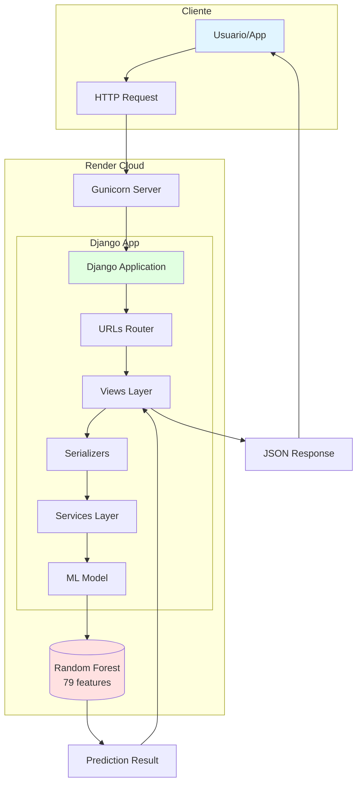

## 🔄 Flujo de una Petición de Predicción

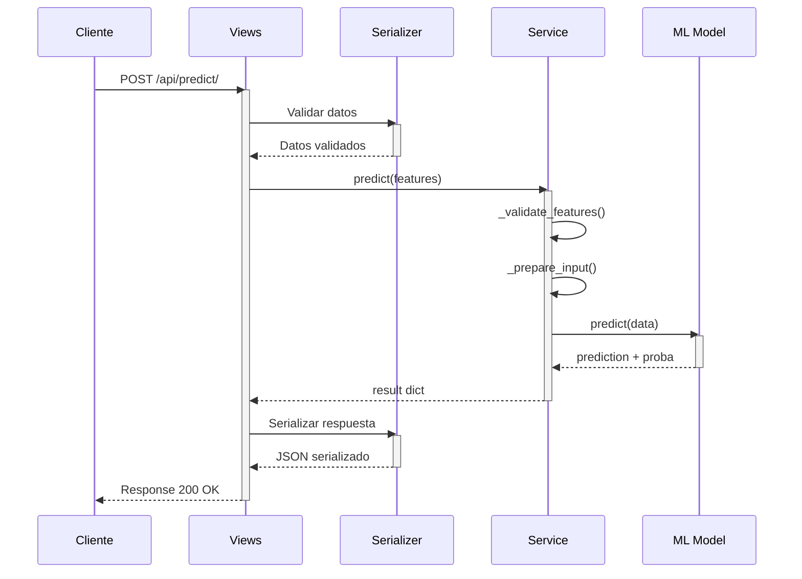

## 🏛️ Arquitectura en Capas

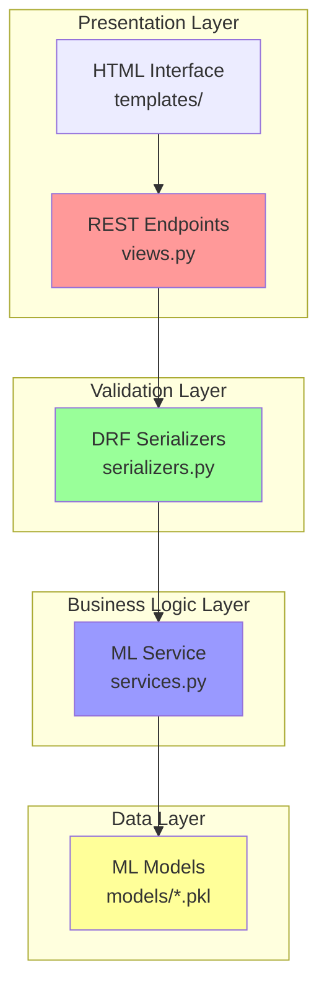

## 📁 Estructura de Archivos

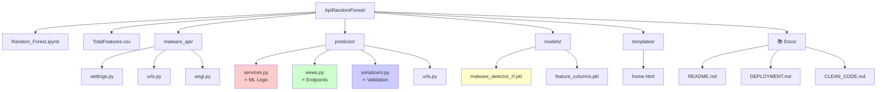

## 🔐 Patrón Singleton del Servicio ML

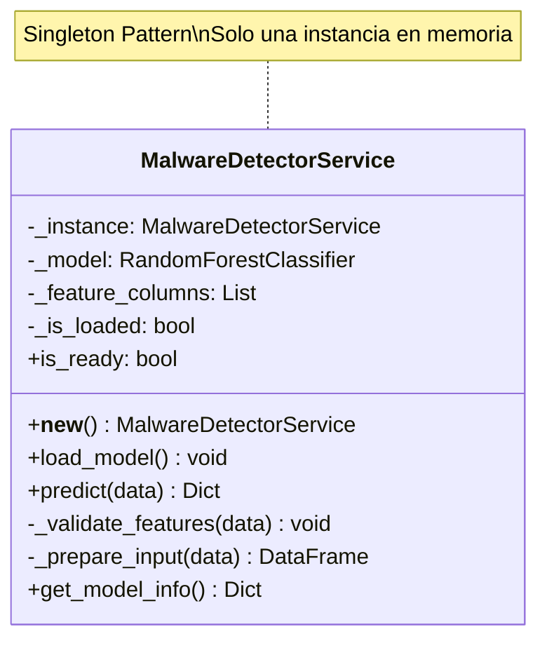

## 🌐 Endpoints y Métodos HTTP

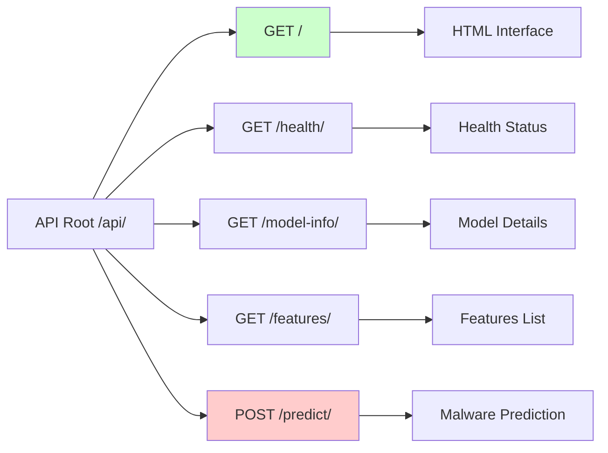

## 🔄 Ciclo de Vida del Request

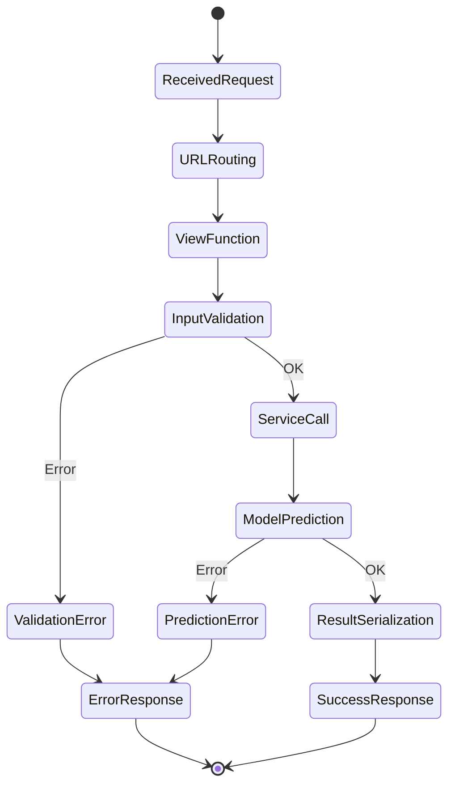

## 🏗️ Stack Tecnológico

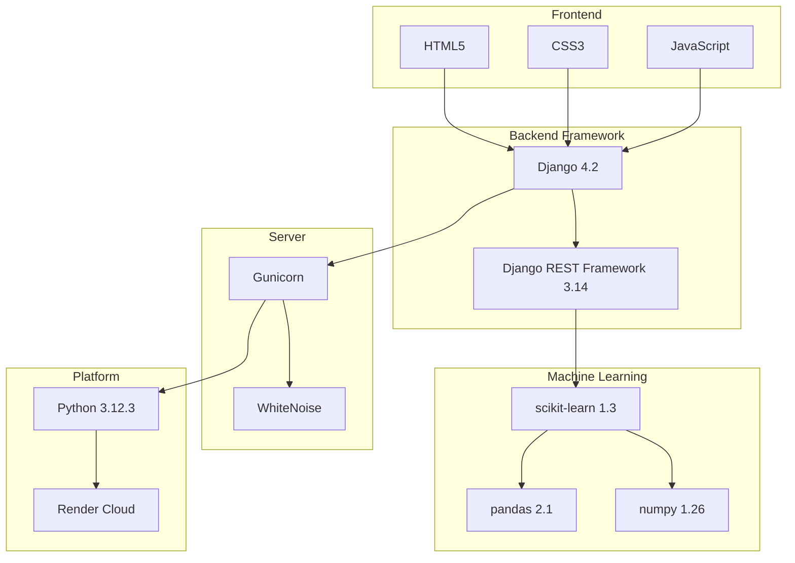

## 📊 Flujo de Datos de ML

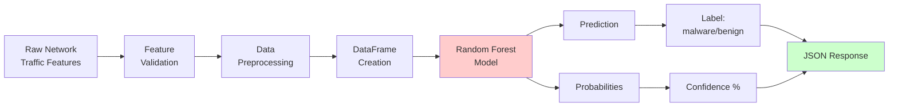

## 🔒 Seguridad y Validación

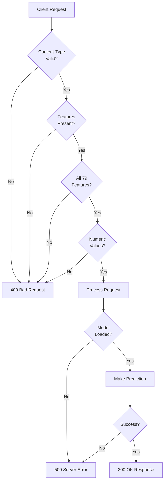

## 🚀 Deployment Pipeline

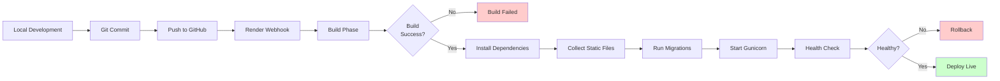

## 💾 Modelo de Datos (Simplified)

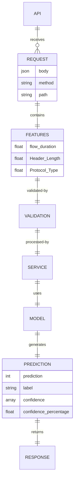

---

## 📝 Cómo Ver los Diagramas

### En GitHub
Los diagramas Mermaid se renderizan automáticamente en GitHub.

### En VS Code
1. Instalar extensión: "Markdown Preview Mermaid Support"
2. Abrir este archivo
3. Presionar `Ctrl+Shift+V` (o `Cmd+Shift+V` en Mac)

### En Otros Editores
1. Copiar el código Mermaid
2. Pegar en [Mermaid Live Editor](https://mermaid.live/)
3. Ver el diagrama renderizado

---

**Estos diagramas te ayudan a entender visualmente la arquitectura del proyecto.** 🎨
